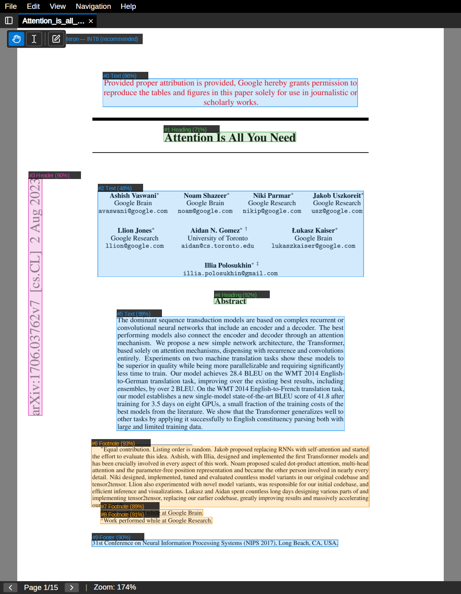
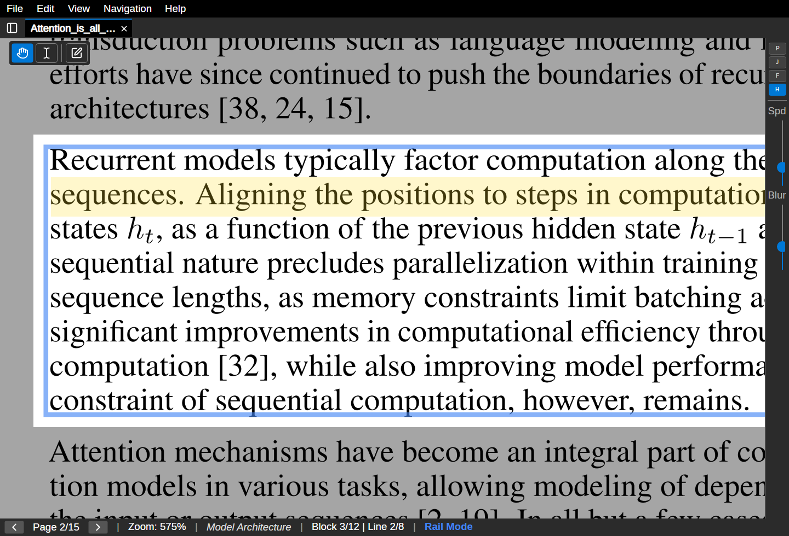

<p align="center">
  
</p>

<h1 align="center">railreader2</h1>

<p align="center">
  Desktop PDF viewer optimised for high magnification viewing with AI-guided "rail reading".<br>
  Built with .NET/Avalonia, PDFtoImage (PDFium) for PDF rasterisation, SkiaSharp for GPU-accelerated rendering, and PP-DocLayoutV3 (ONNX) for layout detection.
</p>

<p align="center">
  <a href="https://github.com/sjvrensburg/railreader2/releases/latest">Download</a> &middot;
  <a href="https://apps.microsoft.com/store/detail/9P9J8KZ6RVZP">Microsoft Store</a> &middot;
  <a href="https://sjvrensburg.github.io/railreader2/">Website</a> &middot;
  <a href="https://sjvrensburg.github.io/railreader2/guide.html">User Guide</a>
</p>

<p align="center">
  <a href="LICENSE"></a>
  <a href="https://claude.ai/code"></a>
</p>

<p align="center">
  <a href="https://apps.microsoft.com/store/detail/9P9J8KZ6RVZP"></a>
</p>

---

<p align="center">
  
  &nbsp;
  
</p>

## License

RailReader2 is licensed under the [MIT License](LICENSE).

Versions prior to 3.0.0 were released under the GNU General Public License v3 (GPLv3). Starting with version 3.0.0, the project is licensed under the MIT License. As the sole author and copyright holder, this relicensing applies to all new releases going forward. Previous releases remain available under the terms of the GPLv3.

## Why I built this

As a visually impaired user, I need a PDF viewer that works comfortably at high magnification for sustained reading. The tech industry rarely builds for this "missing middle": the market is too niche for standard software companies, and tools designed for full blindness aren't appropriate when you have poor-but-usable vision.

High magnification introduces real navigation challenges: context loss, inefficient scrolling, and UI elements that break at zoom. RailReader2 addresses these by using AI layout analysis to guide line-by-line reading through detected text blocks, like a typewriter carriage return across the page.

RailReader2 was built with [Claude Code](https://docs.anthropic.com/en/docs/claude-code). It is an example of how AI-assisted development can enable niche accessibility tools that would otherwise never exist.

## How it works

PDF pages are rasterised by PDFium (via PDFtoImage) at a DPI proportional to the current zoom level (150–600 DPI). The resulting bitmap is uploaded to the GPU as an `SKImage` and drawn on an Avalonia Skia canvas via `ICustomDrawOperation`. Camera pan and zoom are applied as a compositor-level `MatrixTransform` — the bitmap only re-renders when the DPI tier changes, not on every pan/zoom frame.

### Rail reading

At high zoom levels, navigation switches to "rail mode" — the viewer locks onto detected text blocks and advances line-by-line, like a typewriter carriage return. This is powered by [PP-DocLayoutV3](https://huggingface.co/PaddlePaddle/PP-DocLayoutV3) by [PaddlePaddle](https://www.paddlepaddle.org.cn/en), which detects document regions (text, titles, footnotes, etc.) and predicts reading order natively via its Global Pointer Mechanism, correctly handling multi-column layouts, headers, footnotes, etc. See the [technical report](https://arxiv.org/abs/2601.21957). Non-active regions are dimmed so you can focus on the current block and line.

### Features

#### Rail reading

- **Rail toolbar** — docked vertical toolbar with toggle buttons (P/J/F/H) for auto-scroll, jump mode, line focus dim, and line highlight, plus sliders for scroll speed (or jump distance) and motion blur intensity; auto-scroll and jump mode are mutually exclusive
- **Auto-scroll** — toggle continuous horizontal scrolling in rail mode (P key), hold D/Right to boost speed, with configurable pauses at line and block boundaries
- **Auto-scroll trigger** — optionally auto-start auto-scroll after holding D/Right for a configurable delay (default 2s). Off by default, configurable in Settings > Auto-Scroll
- **Jump mode** — saccade-style reading (J key) that advances by a configurable percentage of the visible width; Shift+Right/Left for half-distance short jumps
- **Line focus dim** — smooth feathered dimming of non-active lines to reduce peripheral distraction, with configurable intensity and padding
- **Line highlight toggle** — independently toggle line highlight tint (H key); works with or without line focus blur
- **Line highlight tint** — configurable colour tint on the active line in rail mode (Auto, Yellow, Cyan, Green, or None) with adjustable opacity. Auto adapts to the active colour effect
- **Click-to-select block** — click on any detected block in rail mode to jump to it
- **Free pan in rail mode** — hold Ctrl while dragging to pan and zoom freely (even below rail threshold) to inspect images or equations. Release Ctrl to snap back to your original reading position and zoom level
- **Zoom position preservation** — zooming in rail mode no longer snaps to line start; horizontal scroll position and line screen position are preserved
- **Vertical position preservation** — maintains your panned vertical offset when navigating lines in rail mode
- **Line snap shortcuts** — Home/End keys snap to the start/end of the current line in rail mode
- **Pixel snapping** — quantises camera positions to the pixel grid to eliminate sub-pixel text shimmer at high zoom
- **Edge-hold page navigation** — in non-rail mode, hold Down/S at the page bottom for 400ms to advance to the next page. Same for Up/W at the top edge
- **Analysis lookahead** — pre-analyzes upcoming pages in the background for instant navigation
- **Analysis indicator** — status bar shows "Analyzing..." during layout inference
- **Configurable navigation** — choose which block types are navigable in rail mode via Settings → Advanced

#### Visual comfort

- **Colour effects** — GPU-accelerated accessibility filters (High Contrast, High Visibility, Amber, Invert) with adjustable intensity. Per-document: each tab keeps its own effect, persisted across sessions
- **Colour effect cycling** — press `C` to cycle through colour effects on the active tab, with a brief status bar toast showing the current effect
- **Dark mode** — toggle via Settings → Appearance; switches the Avalonia Fluent theme to dark variant
- **UI font scaling** — adjustable font size via Settings for high-DPI or accessibility use
- **Smooth zoom** — scroll wheel and +/- key zooms animate over 180ms with cubic ease-out; rapid scrolling accumulates smoothly
- **Motion blur** — subtle directional blur during horizontal scroll and zoom for perceptual smoothness, with configurable intensity
- **Fullscreen mode** — F11 hides all chrome for distraction-free reading; Escape exits
- **Colorblind-safe colors** — status bar, link indicators, debug overlay, and annotation highlights use a colorblind-safe palette

#### Navigation & document management

- **Multi-tab support** — open multiple PDFs with independent per-tab state. Right-click a tab for a context menu (Duplicate, Duplicate Linked, Link To, Unlink, Detach to new window, Close)
- **Linked tabs** — duplicate tabs can be linked to always stay on the same page. Chain icon and colored dot indicator on linked tabs. Linked tabs are kept adjacent and move as a group
- **Tab bar overflow** — tabs shrink with ellipsis when many are open. Horizontal mouse wheel scrolls the tab bar. Overflow dropdown button lists all tabs
- **Outline and bookmarks panel** — tabbed pane with table of contents and named bookmarks (Ctrl+Shift+O for outline, Ctrl+Shift+B for bookmarks)
- **Named bookmarks** — bookmark any page with a custom name (B key or + button in the bookmarks pane). Navigate to bookmarks with a single click. Rename and delete inline. "Back to previous location" button for quick return after jumping. Bookmarks persist in the annotation sidecar file
- **Interactive minimap** — click or drag to navigate the page
- **On-screen nav buttons** — ◀/▶ buttons in the status bar for mouse-only page navigation
- **Search** — full-text search in a sidebar panel with results grouped by page, text snippets with highlighted match terms, regex and case sensitivity toggles, and match highlighting on the page (Ctrl+F)

#### Annotations & text

- **Annotations** — highlight, freehand pen, rectangles, text notes, and eraser via radial menu (right-click). Colour picker for highlight (yellow/green/pink) and pen (red/blue/black). Collapsible popup notes with folded-corner icon. Select, move, and resize annotations in browse mode. Delete selected annotations with the Delete key.
- **Text selection** — select and copy text from PDF pages via the toolbar
- **Toolbar** — floating Browse/Text Select/Copy toolbar for quick mode switching
- **Annotation export** — export PDFs with embedded annotations (File → Export with Annotations)
- **Annotation JSON export** — export annotation data as JSON (File → Export Annotations as JSON)
- **Annotation import** — import annotations from a JSON file and merge with existing (File → Import Annotations). Share annotations with other RailReader2 users
- **Undo/redo** — annotation history with Ctrl+Z / Ctrl+Y
- **Annotation mode indicator** — status bar shows active tool name in amber with a clickable exit button
- **Annotation tool cursors** — each annotation tool shows a distinct mouse cursor (crosshair for drawing tools, I-beam for text select, no-entry for eraser) so you always know the active mode
- **Tab-switch tool reset** — switching tabs automatically exits any active annotation mode to prevent accidental edits

#### Headless CLI

- **Render pages as PNG** — export PDF pages as images with optional colour effects (high contrast, high visibility, amber, invert) and annotation overlay baked in
- **Extract document structure** — output outline, ONNX layout blocks, and per-block text as JSON
- **Export annotations** — export annotations as rich JSON (with extracted text, layout block correlations, and nearest section headings) or as an annotated PDF
- Ships as separate standalone binaries for Linux and Windows on [GitHub Releases](https://github.com/sjvrensburg/railreader2/releases/latest)

#### General

- **Menu bar** — File, View, Navigation, Help menus with keyboard shortcuts
- **Settings panel** — live-editable rail reading parameters with persistence
- **Tabbed settings** — organised settings panel with Appearance, Rail Reading, Auto-Scroll, and Advanced tabs
- **Keyboard shortcuts dialog** — press F1 or Help → Keyboard Shortcuts for a complete reference
- **Tooltips** — all interactive controls have descriptive tooltips
- **Splash screen** — startup splash while ONNX model loads
- **About dialog** — version info and credits (Help → About)
- **Diagnostic logging** — session log file written to the config directory; export via Help → Export Diagnostic Log, or copy the path from Help → About for bug reports
- **Disk cleanup** — removes cache, old logs, temp files (Help → Clean Up Temp Files)
- **Debug overlay** — visualise detected layout blocks with class labels and confidence
- **Bionic reading** — *(Removed in 3.2)* shader-based text fading that de-emphasised the trailing portion of each word, guiding the eye to fixation points

## Installation

Download the latest release from [GitHub Releases](https://github.com/sjvrensburg/railreader2/releases/latest). The AI layout model is bundled in all packages. Standalone CLI binaries (`railreader2-cli-linux-x64` and `RailReader2.Cli.exe`) are also available from the same release page.

### Linux

Download `railreader2-linux-x86_64.AppImage`, make it executable, and run it:

```bash
chmod +x railreader2-linux-x86_64.AppImage
./railreader2-linux-x86_64.AppImage
```

### Windows

There are two ways to install on Windows:

**Microsoft Store** (recommended): Install directly from the [Microsoft Store](https://apps.microsoft.com/store/detail/9P9J8KZ6RVZP). This provides automatic updates, no SmartScreen warnings, and clean install/uninstall. Note: the Store release may lag behind the GitHub release by a few days due to certification review.

**Standalone installer**: Download `railreader2-setup-x64.exe` from [GitHub Releases](https://github.com/sjvrensburg/railreader2/releases/latest) and run it. This always has the latest version immediately.

> **Windows SmartScreen warning** (standalone installer only)
>
> Windows may show a "Windows protected your PC" SmartScreen warning because the standalone installer is not code-signed. This does not apply to the Microsoft Store version.
>
> To proceed:
> 1. Click **More info** in the SmartScreen dialog.
> 2. Click **Run anyway**.
>
> If your browser warns that the file "may be harmful", choose **Keep** (Chrome) or **Keep anyway** (Edge) before running it. The source code is fully public on GitHub — you can verify what is being installed.

## Usage

After installing, launch RailReader2 from your application menu or desktop shortcut. You can also open a PDF directly from your file manager by double-clicking (once associated) or by passing the file as a command-line argument:

```
railreader2 <path-to-pdf>
```

Use **File → Open** (Ctrl+O) to open a PDF from within the app.

### CLI usage

The headless CLI (`railreader2-cli`) provides three commands for automated PDF extraction:

```bash
# Render pages as PNG with amber colour effect
railreader2-cli render paper.pdf --pages 1-5 --effect amber --output-dir ./out

# Extract document structure with layout analysis
railreader2-cli structure paper.pdf --analyze --include-text --output structure.json

# Export annotations with extracted text and block context
railreader2-cli annotations paper.pdf --include-text --output annotations.json
```

Run `railreader2-cli --help` or `railreader2-cli <command> --help` for all options.

### Controls

| Key | Action |
|-----|--------|
| Ctrl+O | Open file |
| Ctrl+W | Close tab |
| Ctrl+Tab | Next tab |
| Ctrl+Q | Quit |
| PgDown / PgUp | Next / previous page |
| Home / End | First / last page |
| Ctrl+Home / Ctrl+End | First / last page |
| Space | Next line (rail mode) or next page |
| +/- | Zoom in / out |
| 0 | Reset zoom and position |
| Arrow Down / Up (S / W) | Next / previous line (rail mode) or pan; hold at page edge for 400ms to advance page (non-rail) |
| Arrow Right / Left (D / A) | Hold to scroll along line (rail mode) or pan |
| Ctrl + Mouse wheel | Horizontal scroll along line (rail mode) |
| Ctrl+Drag | Free pan in rail mode (release Ctrl to snap back) |
| Mouse drag | Pan |
| Mouse wheel | Zoom towards cursor |
| Click on block | Jump to block (rail mode) |
| Home / End | Line start / end (rail mode) or first / last page |
| P | Toggle auto-scroll (rail mode), D/Right to boost |
| J | Toggle jump mode (saccade-style advance) |
| B | Add bookmark for current page |
| ` (backtick) | Navigate back to previous location |
| C | Cycle colour effect on active tab |
| F | Toggle line focus dim (rail mode) |
| H | Toggle line highlight tint (rail mode) |
| Shift+Right / Shift+Left | Short jump — half distance (jump mode) |
| [ / ] | Adjust scroll speed or jump distance (rail mode) |
| Shift+[ / Shift+] | Adjust blur intensity (rail mode) |
| D (shift) | Toggle debug overlay (shows detected blocks) |
| Ctrl+Shift+B | Toggle bookmarks pane |
| Ctrl+F | Open search panel |
| F3 / Shift+F3 | Next / previous search match |
| Right-click | Open annotation radial menu |
| Ctrl+Z / Ctrl+Y | Undo / redo annotation |
| Delete / Backspace | Delete selected annotation (browse mode) |
| Ctrl+C | Copy selected text |
| F11 | Toggle fullscreen (hides chrome) |
| Escape | Stop auto-scroll / cancel annotation tool / close search / exit fullscreen |
| F1 | Keyboard shortcuts dialog |

### Configuration

Rail reading parameters are editable via the Settings panel (gear icon in menu bar) and persisted to the platform config directory (`~/.config/railreader2/config.json` on Linux, `%APPDATA%\railreader2\config.json` on Windows):

```json
{
  "rail_zoom_threshold": 3.0,
  "snap_duration_ms": 300.0,
  "scroll_speed_start": 10.0,
  "scroll_speed_max": 30.0,
  "scroll_ramp_time": 1.5,
  "analysis_lookahead_pages": 2,
  "ui_font_scale": 1.25,
  "colour_effect": "None",
  "colour_effect_intensity": 1.0,
  "motion_blur": true,
  "motion_blur_intensity": 0.33,
  "pixel_snapping": true,
  "line_focus_blur": false,
  "line_focus_blur_intensity": 0.5,
  "line_padding": 0.2,
  "line_highlight_enabled": true,
  "line_highlight_tint": "Auto",
  "line_highlight_opacity": 0.25,
  "auto_scroll_line_pause_ms": 400.0,
  "auto_scroll_block_pause_ms": 600.0,
  "jump_percentage": 25.0,
  "dark_mode": false,
  "navigable_classes": [
    "abstract", "algorithm", "display_formula",
    "footnote", "paragraph_title", "text"
  ],
  "centering_classes": [
    "abstract", "algorithm", "display_formula",
    "footnote", "text"
  ],
  "auto_scroll_trigger_enabled": false,
  "auto_scroll_trigger_delay_ms": 2000.0
}
```

| Parameter | Description |
|-----------|-------------|
| `rail_zoom_threshold` | Zoom level at which rail mode activates |
| `snap_duration_ms` | Duration of line-snap animations (ms) |
| `scroll_speed_start` | Initial horizontal scroll speed (page points/sec) |
| `scroll_speed_max` | Maximum scroll speed after holding (page points/sec) |
| `scroll_ramp_time` | Seconds to reach max speed from start |
| `analysis_lookahead_pages` | Number of pages to pre-analyze ahead (0 to disable) |
| `ui_font_scale` | UI font size multiplier (e.g. `1.25` for 25% larger text) |
| `colour_effect` | Colour filter: `None`, `HighContrast`, `HighVisibility`, `Amber`, `Invert` |
| `colour_effect_intensity` | Effect intensity from 0.0 (off) to 1.0 (full) |
| `motion_blur` | Enable subtle directional blur during scroll and zoom (`true`/`false`) |
| `motion_blur_intensity` | Motion blur strength from 0.0 (off) to 1.0 (maximum) |
| `pixel_snapping` | Quantise camera positions to pixel grid to reduce text shimmer (`true`/`false`) |
| `line_focus_blur` | Dim non-active lines in rail mode (`true`/`false`) |
| `line_focus_blur_intensity` | Line focus dim strength from 0.0 (off) to 1.0 (maximum) |
| `line_padding` | Padding around active line as fraction of line height (0.0–0.5) |
| `line_highlight_enabled` | Enable line highlight tint independently of line focus blur (`true`/`false`) |
| `line_highlight_tint` | Colour tint on active line in rail mode: `Auto`, `Yellow`, `Cyan`, `Green`, `None` |
| `line_highlight_opacity` | Line highlight tint opacity from 0.0 (off) to 1.0 (full) |
| `auto_scroll_line_pause_ms` | Pause duration at line boundaries during auto-scroll (ms, 0 to disable) |
| `auto_scroll_block_pause_ms` | Pause duration at block boundaries during auto-scroll (ms, 0 to disable) |
| `jump_percentage` | Jump distance as percentage of visible width (5–80%) |
| `dark_mode` | Enable dark UI theme (`true`/`false`) |
| `navigable_classes` | Which block types rail mode navigates (array of class names). Configurable via Settings → Advanced. |
| `centering_classes` | Which block types are horizontally centered when narrower than the viewport (array of class names). Excludes headings by default. Configurable via Settings → Advanced. |
| `auto_scroll_trigger_enabled` | Auto-start auto-scroll after holding D/Right for the trigger delay (`true`/`false`, default `false`) |
| `auto_scroll_trigger_delay_ms` | Delay before auto-scroll triggers from hold (ms, default 2000) |

## Removed features

Version 3.2 simplified the application to reduce complexity and make it less intimidating for new users. Bionic reading was removed because it was counterproductive with maths-heavy documents (the primary use case). The original CLI and AI Agent were developer-only tools that were never shipped in binary releases, so they were removed. A new headless CLI has since been reintroduced as a shipped product — see the [Headless CLI](#headless-cli) section above.

## Architecture

The codebase is split into a rendering-agnostic core library, a shared SkiaSharp renderer, a thin Avalonia UI shell, and headless tests:

```
RailReader2.slnx              # Default solution
├── src/RailReader.Core/        # Business logic (zero Avalonia, zero SkiaSharp)
├── src/RailReader.Renderer.Skia/ # SkiaSharp rendering (implements Core interfaces)
├── src/RailReader2/            # Thin Avalonia UI shell
├── src/RailReader2.Cli/        # Headless CLI (references Core + Renderer.Skia, zero Avalonia)
└── tests/RailReader.Core.Tests/  # 100 xUnit headless tests
```

*(Removed in 3.2)* Previous versions included `src/RailReader.Cli/` (command-line interface) and `src/RailReader.Agent/` (AI agent CLI). These were removed in 3.2.

**RailReader.Core** contains `DocumentController` (the headless orchestration facade), `DocumentState` (per-document state), all Models and Services. It has no rendering-library dependency — PDF rendering is abstracted behind `IPdfService`/`IPdfTextService` interfaces. The test project uses it directly.

**RailReader.Renderer.Skia** implements Core's rendering interfaces using PDFium and SkiaSharp. It also contains all Skia drawing code (annotations, overlays, shaders, screenshot compositing).

## Command-line interface

A standalone headless CLI (`railreader2-cli`) for automated PDF extraction. Ships as separate binaries on [GitHub Releases](https://github.com/sjvrensburg/railreader2/releases/latest).

```bash
# Render pages as PNG
railreader2-cli render paper.pdf --pages 1-5 --dpi 300 --effect amber --output-dir ./out

# Extract structure (outline + layout blocks + text)
railreader2-cli structure paper.pdf --analyze --include-text --output structure.json

# Export annotations with text and layout context
railreader2-cli annotations paper.pdf --include-text --include-blocks --output annotations.json
```

The CLI uses the ONNX layout model from the GUI installation. If the GUI isn't installed, download the model with `./scripts/download-model.sh`.

## Building

### Dependencies

- .NET 10 SDK
- ONNX model (see below)

### ONNX model

Download the PP-DocLayoutV3 model for AI layout analysis:

```bash
./scripts/download-model.sh
```

The model is placed in `models/PP-DocLayoutV3.onnx`. Without it, a simple fallback layout (horizontal strips) is used.

### Build

```bash
dotnet build RailReader2.slnx
```

### Test

```bash
dotnet test tests/RailReader.Core.Tests
```

### Run from source

```bash
# Open a specific PDF
dotnet run -c Release --project src/RailReader2 -- <path-to-pdf>

# Launch without arguments and use File → Open (Ctrl+O)
dotnet run -c Release --project src/RailReader2 --

# Run the CLI
dotnet run -c Release --project src/RailReader2.Cli -- render <pdf> --output-dir ./out
```

### Publish self-contained

```bash
# Linux
dotnet publish src/RailReader2 -c Release -r linux-x64 --self-contained

# Windows
dotnet publish src/RailReader2 -c Release -r win-x64 --self-contained
```
