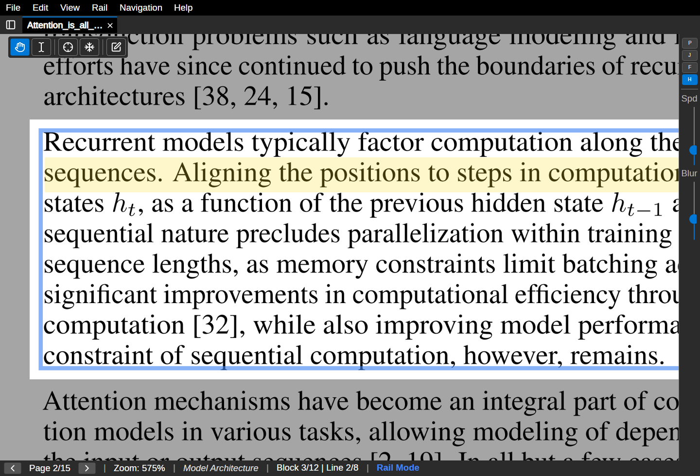
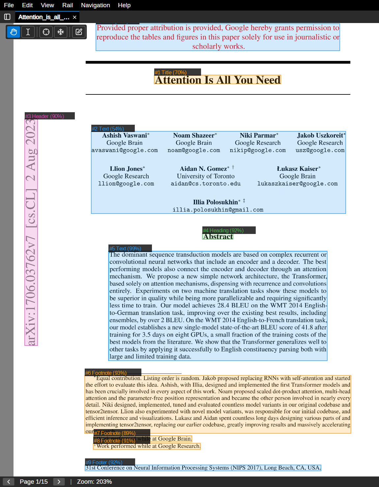
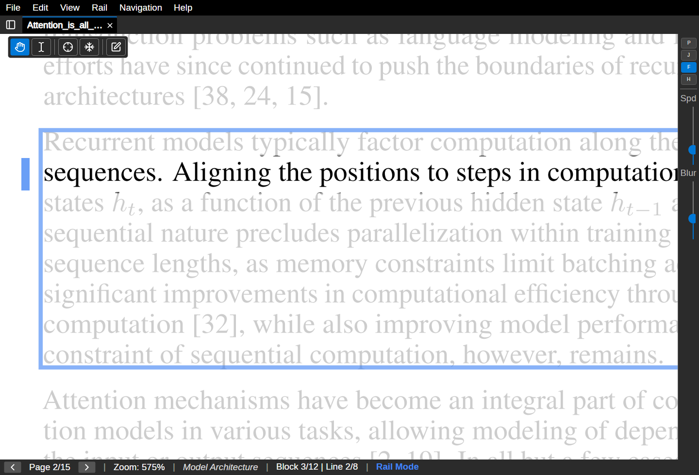
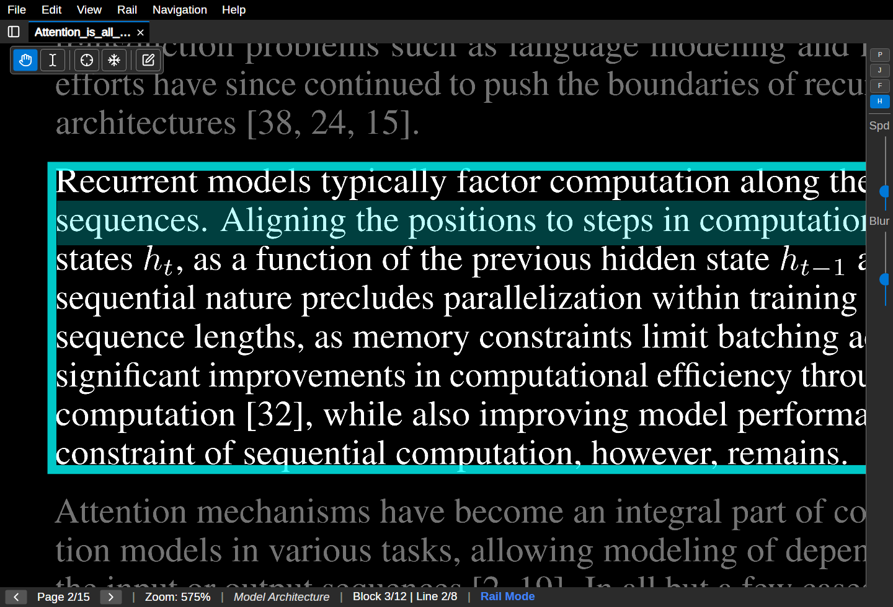
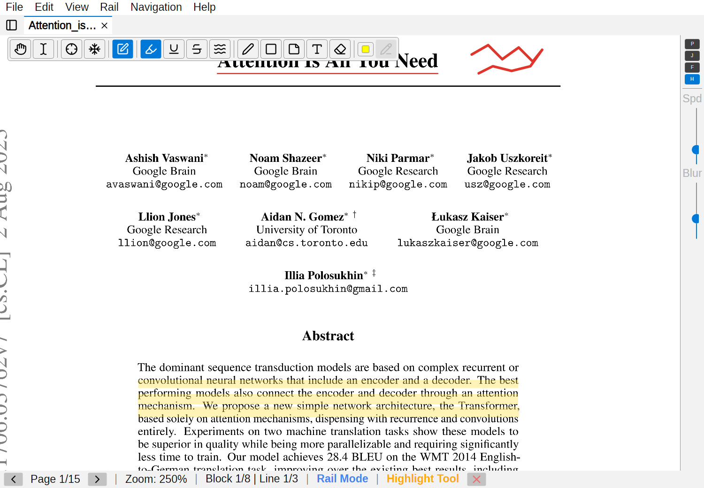

<p align="center">
  
</p>

<h1 align="center">railreader2</h1>

<p align="center">
  <strong>A PDF reader built for comfortable reading at high magnification.</strong><br>
  It finds the text on each page and carries you through it line by line, so you never lose your place when zoomed in.
</p>

<p align="center">
  <a href="https://github.com/sjvrensburg/railreader2/releases/latest">Download</a> &middot;
  <a href="https://apps.microsoft.com/store/detail/9P9J8KZ6RVZP">Microsoft Store</a> &middot;
  <a href="https://sjvrensburg.github.io/railreader2/">Website</a> &middot;
  <a href="https://sjvrensburg.github.io/railreader2/guide.html">User Guide</a>
</p>

<p align="center">
  <a href="LICENSE"></a>
  <a href="https://github.com/sjvrensburg/railreader2/releases/latest"></a>
  <a href="https://claude.ai/code"></a>
</p>

<p align="center">
  <a href="https://apps.microsoft.com/store/detail/9P9J8KZ6RVZP"></a>
</p>

<p align="center">
  
</p>

## What is rail reading?

Zoom in far enough on an ordinary PDF and reading becomes a chore: you scroll right to the end of a line, hunt for the start of the next one, and drift into the wrong column or paragraph. RailReader2 removes the hunting.

When you open a page, an AI layout model works out where the paragraphs, headings, equations, tables and figures are, and in what order they should be read. Once you zoom past about 300%, the view locks onto that text like a train on a rail:

- **Down** moves to the next line, and the view glides to its start, like a typewriter carriage return.
- **Right** scrolls along the line, speeding up the longer you hold it.
- Paragraphs, columns and pages follow each other in reading order, and figures and margins are skipped.
- Optionally, the lines around the one you are reading are dimmed or highlighted so your eye stays put.

Everything runs on your own computer. The layout model is included in the download, and nothing is sent anywhere unless you set up the optional AI features yourself.

<p align="center">
  
  &nbsp;
  
</p>

## Highlights

**Reading at high zoom**
- Line-by-line rail reading through paragraphs, columns and pages, in reading order.
- Semi-automatic scrolling (`P`): flows through prose on its own and stops at equations, tables, figures and headings until you press a key to continue.
- Jump mode (`J`) for reading in short hops instead of a continuous scroll.
- Line focus (`F`) and line highlight (`H`) keep your eye on the current line.
- Freeze panes (toolbar snowflake): pin a table's header row or label column while the rest scrolls, like in a spreadsheet.
- Portals: keep a figure or table in view while you read the paragraph that refers to it. "See Figure 3" can pin Figure 3 automatically.
- Hold `Ctrl` and drag to look around freely, then let go to snap back to where you were.

**Easy on the eyes**
- Colour filters (high contrast, high visibility, amber, invert), cycled with `C` and remembered per document.
- Dark mode, larger interface text, and sharp rendering at any zoom.
- Margin cropping, so blank margins don't waste screen space.

**Finding your way around**
- Tabs, side-by-side split views (`Ctrl+\`), and views that can be torn off into their own window.
- Outline, named bookmarks, full-text search, and a browsable index of every figure, table and equation.
- Jump straight to the next heading, figure, table or equation.
- Clickable links and citations, with back and forward history.
- Optional continuous scrolling from page to page.

**Scanned documents**
- Optional text recognition (OCR) for pages that are only a picture of text, so rail reading, search and highlighting work on them too.
- Automatic correction for slightly crooked scans, and downloadable language packs for non-Latin scripts.
- Rotate sideways pages and tables (`Ctrl+R`).

**Notes and highlights**
- Highlight, underline, strike out, draw, add text notes and text boxes, with undo.
- Spell checking in notes (British and American English included, and you can add other Hunspell dictionaries).
- Annotations save automatically. You can export them into a copy of the PDF or share them as a file, and comments already in a PDF (from a reviewer, say) appear in the comments list alongside your own.

**Equations, tables and figures**
- Copy an equation as LaTeX, a table as Markdown, or a figure as a description, using an AI vision model of your choice: a cloud service, or a local one through Ollama or vLLM. This is optional and off until you configure it.
- Command-line tool to turn a whole PDF into structured Markdown, or extract its annotations and structure as JSON.

<p align="center">
  
  &nbsp;
  
</p>

## Install

The download includes everything you need, including the layout model.

### Windows

- **[Microsoft Store](https://apps.microsoft.com/store/detail/9P9J8KZ6RVZP)** (recommended): automatic updates and no security warnings. New versions can arrive a few days after the GitHub release while the Store reviews them.
- **Installer**: download `railreader2-setup-x64.exe` from the [latest release](https://github.com/sjvrensburg/railreader2/releases/latest).

<details>
<summary>Windows says "Windows protected your PC"</summary>

The standalone installer isn't code-signed, so Windows SmartScreen may warn about it (the Store version doesn't have this problem). Click **More info**, then **Run anyway**. If your browser says the file "may be harmful", choose **Keep** (Chrome) or **Keep anyway** (Edge) first. The source code is public, so you can check exactly what you're installing.
</details>

### Linux

Download `railreader2-x86_64.AppImage` from the [latest release](https://github.com/sjvrensburg/railreader2/releases/latest), make it executable, and run it:

```bash
chmod +x railreader2-x86_64.AppImage
./railreader2-x86_64.AppImage
```

RailReader2 is also listed in the [AppImage catalogue](https://appimage.github.io/railreader2/), and the AppImage supports in-place updates with AppImageUpdate. If you'd rather not use an AppImage, a plain `railreader2-linux-x64.tar.gz` is on the same page.

## Getting started

1. Open a PDF with **File → Open** (`Ctrl+O`), from your file manager, or on the command line: `railreader2 paper.pdf`.
2. Zoom in with the mouse wheel or `+`. Past about 300%, rail mode switches on and the current line is highlighted.
3. Read with **Down** / **Up** (or `S` / `W`) for the next or previous line, and hold **Right** / **Left** (or `D` / `A`) to move along the line.
4. Press `P` to let it scroll for you, and `D` to continue when it stops at an equation or figure.

Press **F1** at any time for the full list of keyboard shortcuts. These are the ones you'll use most:

| Key | Action |
|-----|--------|
| `Down` / `Up` (`S` / `W`) | Next / previous line in rail mode, otherwise pan |
| `Right` / `Left` (`D` / `A`) | Scroll along the line (hold to speed up) |
| `Home` / `End` | Start / end of the line in rail mode, otherwise first / last page |
| `Space`, `PgDn` / `PgUp` | Next line or page / previous page |
| `+` / `-` / `0` | Zoom in / zoom out / fit page |
| `R` | Start rail reading here, at the current zoom |
| `P` / `J` | Auto-scroll / jump mode |
| `F` / `H` | Line focus / line highlight |
| `[` / `]` | Slower / faster scrolling |
| `Ctrl`+drag | Look around freely, then let go to snap back |
| `C` | Cycle colour filters |
| `Z` | Freeze panes / unfreeze |
| `B` | Bookmark this page |
| `Ctrl+Shift+H` / `G` / `T` / `E` | Next heading / figure / table / equation |
| `Ctrl+F` | Search |
| `Ctrl+E` | Annotation mode |
| `Alt+Left` / `Alt+Right` | Back / forward |
| `F11` | Full screen |
| `Ctrl+,` | Settings |

## Settings

**Settings** (`Ctrl+,`) opens with the options most readers change: reading pace, how the current line is marked, colours and text size, when auto-scroll stops, scanned pages, and spelling. Tick **Show advanced settings** for everything else, including render quality, layout models, GPU acceleration and the AI assistant.

The [User Guide](https://sjvrensburg.github.io/railreader2/guide.html) explains every setting.

### Optional extras

- **Faster page analysis**: on a supported graphics card, layout detection or text recognition can run on the GPU, roughly ten times faster (Settings → Performance).
- **Linux laptops with two graphics chips**: if scrolling feels sluggish on a large screen, try Settings → Performance → Display GPU to draw the window on the dedicated graphics card.
- **AI copy for equations, tables and figures**: point Settings → AI Assistant at any OpenAI-compatible vision API. See the [vision-model setup guide](docs/vllm-guide.md) for cloud and local options.
- **Other layout models**: Docling Heron (the default) suits most documents, and PP-DocLayoutV3 is an alternative tuned for academic papers. See the [layout model guide](docs/heron-layout-model.md).

<details>
<summary>Editing the config file directly</summary>

Settings are saved to `~/.config/railreader2/config.json` (Linux) or `%APPDATA%\railreader2\config.json` (Windows). The Settings window covers all of these, but you can edit the file while the app is closed. Some useful fields:

| Field | Meaning |
|-------|---------|
| `rail_zoom_threshold` | Zoom level at which rail mode switches on (default `3.0`) |
| `snap_duration_ms` | Length of the glide to the next line (ms) |
| `scroll_speed_start` / `scroll_speed_max` | Scrolling speed along a line when you start holding the key / after `scroll_ramp_time` seconds |
| `auto_scroll_line_pause_ms` | Pause at the end of each line during auto-scroll |
| `auto_scroll_stop_classes` | Block types auto-scroll stops at, e.g. `Heading`, `DisplayMath`, `Table`, `Figure` |
| `navigable_roles` | Block types rail mode reads, e.g. `Text`, `Heading`, `DisplayMath`, `Caption` |
| `centering_roles` | Block types centred when narrower than the screen |
| `jump_percentage` | Jump mode step, as a percentage of the screen width |
| `line_focus_blur`, `line_focus_blur_intensity` | Dim the lines around the current one |
| `line_highlight_enabled`, `line_highlight_tint`, `line_highlight_opacity` | Tint the current line (`auto`, `yellow`, `cyan`, `green`) |
| `colour_effect`, `colour_effect_intensity` | Default colour filter for new documents |
| `margin_cropping` | Fit to the text area instead of the whole page |
| `continuous_scroll` | Scroll smoothly from page to page |
| `render_quality` | Sharpness preset (`0` Ultra … `5` Performance, `6` Custom) |
| `deskew_ocr_lines` | Correct crooked scans (needs OCR) |
| `ui_font_scale`, `dark_mode` | Interface text size and theme |
</details>

## Command-line tool

A separate command-line program, `railreader2-cli`, handles batch work without opening a window. Download `railreader2-cli-linux-x64.tar.gz` or `railreader2-cli-win-x64.zip` from the [latest release](https://github.com/sjvrensburg/railreader2/releases/latest).

```bash
# Convert a PDF to Markdown: headings, LaTeX equations, tables, figures and your annotations
railreader2-cli export paper.pdf --output paper.md

# The same, with equations and tables transcribed by a vision model
railreader2-cli export paper.pdf --endpoint https://api.openai.com/v1 --model gpt-5.4-nano-2026-03-17 --output paper.md

# Export your annotations, with the text under each one and its section heading
railreader2-cli annotations paper.pdf --include-text --include-blocks --output annotations.json

# Extract the outline, detected blocks and their text
railreader2-cli structure paper.pdf --analyze --include-text --output structure.json

# Save pages as images, optionally with a colour filter
railreader2-cli render paper.pdf --pages 1-5 --dpi 300 --effect amber --output-dir ./out
```

Encrypted PDFs take `--password`. Run `railreader2-cli <command> --help` for every option, or see the [CLI section of the User Guide](https://sjvrensburg.github.io/railreader2/guide.html#cli-tool). The JSON formats are stable: breaking changes only happen in major versions, so other tools can build on them. [railmark](https://github.com/sjvrensburg/railmark), for example, turns your annotations into a Markdown summary.

## Why I built this

As a visually impaired user, I need a PDF viewer that works comfortably at high magnification for sustained reading. The tech industry rarely builds for this "missing middle": the market is too niche for standard software companies, and tools designed for full blindness aren't appropriate when you have poor-but-usable vision. [Read more →](https://sjvrensburg.github.io/railreader2/about.html)

## For developers

RailReader2 is a .NET 10 / [Avalonia](https://avaloniaui.net/) app. The reading engine (rail navigation, layout analysis, rendering, annotations, search, Markdown export) lives in [RailReaderCore](https://github.com/sjvrensburg/RailReaderCore) and is used here as NuGet packages. This repository holds the desktop app, the CLI, and their tests.

```bash
./scripts/download-model.sh                               # layout models (Heron INT8 + PP-DocLayoutV3)
dotnet build RailReader2.slnx                             # build app + CLI + tests
dotnet run -c Release --project src/RailReader2 -- paper.pdf
dotnet test tests/RailReader.Export.Tests
dotnet publish src/RailReader2 -c Release -r linux-x64 --self-contained   # or win-x64
```

Use `-c Release` when running; debug builds are much slower. Without a layout model, RailReader2 still rail-reads using the PDF's own text layer, but can't tell headings, equations and figures apart. [CLAUDE.md](CLAUDE.md) describes the architecture in detail, and [DISTRIBUTION.md](DISTRIBUTION.md) covers releases.

## Acknowledgements

RailReader2 stands on the shoulders of a lot of open-source work. Thank you to:

- **[Avalonia](https://avaloniaui.net/)**, the cross-platform .NET UI framework the whole app is built on.
- **[PDFium](https://pdfium.googlesource.com/pdfium/)** (via [bblanchon's native builds](https://github.com/bblanchon/pdfium-binaries)) and **[PDFtoImage](https://github.com/sungaila/PDFtoImage)** by David Sungaila, for PDF rendering.
- **[SkiaSharp](https://github.com/mono/SkiaSharp)**, for GPU-accelerated 2D drawing.
- **[ONNX Runtime](https://onnxruntime.ai/)**, **[Docling](https://github.com/docling-project/docling)** ([Heron layout model](docs/heron-layout-model.md)) and **[PaddlePaddle](https://github.com/PaddlePaddle/PaddleX)** (PP-DocLayoutV3 / PP-DocLayout-S), the layout-detection models rail mode is built on.
- **[RapidOCR](https://github.com/RapidAI/RapidOCR)** and **[RapidOcrNet](https://github.com/BobLd/RapidOcrNet)** by BobLd, for reading scanned pages.
- **[WeCantSpell.Hunspell](https://github.com/aarondandy/WeCantSpell.Hunspell)** and the [LibreOffice dictionaries](https://github.com/LibreOffice/dictionaries), for spell checking.
- **[Lucide](https://lucide.dev/)**, for the icons.
- **[CommunityToolkit.Mvvm](https://github.com/CommunityToolkit/dotnet)**, for MVVM plumbing.
- **[Claude Code](https://docs.anthropic.com/en/docs/claude-code)**, which made it possible to build this project at all ([more here](https://sjvrensburg.github.io/railreader2/about.html)).

RailReader2 is one of several open-source PDF readers, each with a different focus. If it isn't the right fit for you, try these:

- **[Sioyek](https://sioyek.info/)**, a keyboard-driven PDF reader built for research papers. Its **Portals** feature, which keeps a linked figure or table in view while you read the text that cites it, directly inspired [RailReader2's Portals](docs/portals-design.md). The concept and the name are borrowed with thanks.
- **[Caly](https://github.com/CalyPdf/Caly)** by BobLd, a cross-platform PDF reader built on [PdfPig](https://github.com/UglyToad/PdfPig) and [PdfPig.Rendering.Skia](https://github.com/BobLd/PdfPig.Rendering.Skia), from the author of RapidOcrNet. If you want a lean, PdfPig-native reader, give it a try.

## License

RailReader2 is released under the [MIT License](LICENSE). Versions before 3.0.0 were released under the GPLv3 and remain available under those terms.
