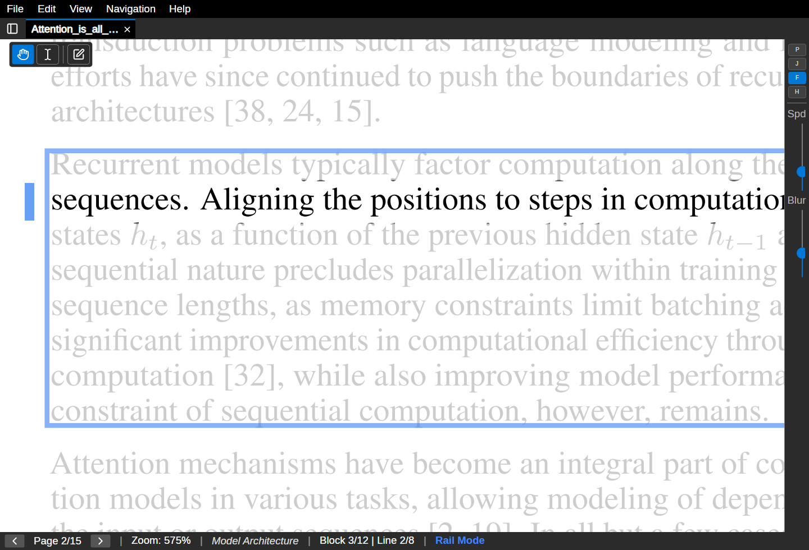
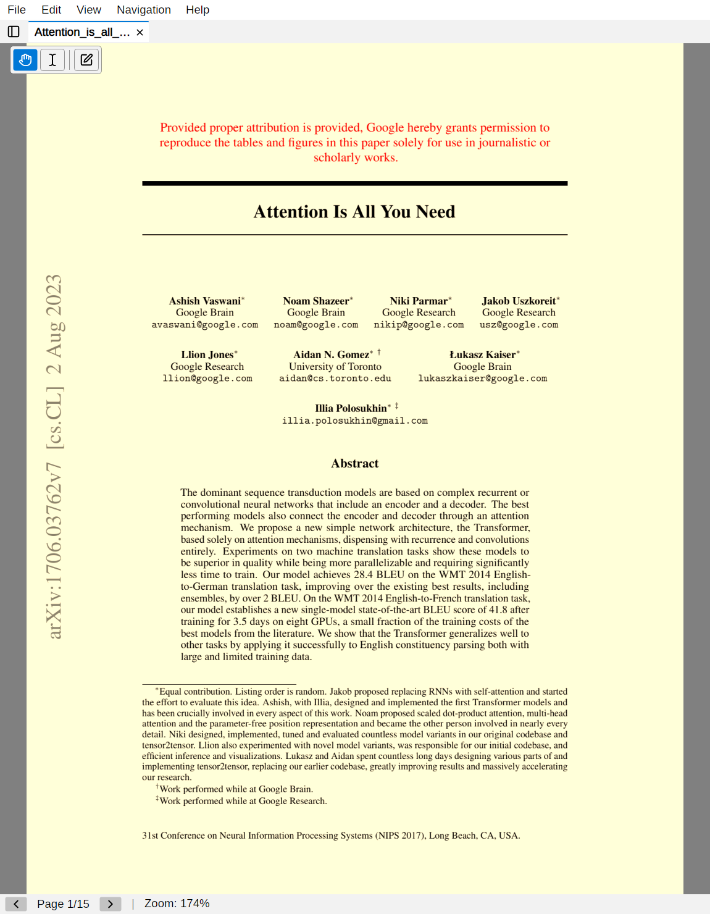
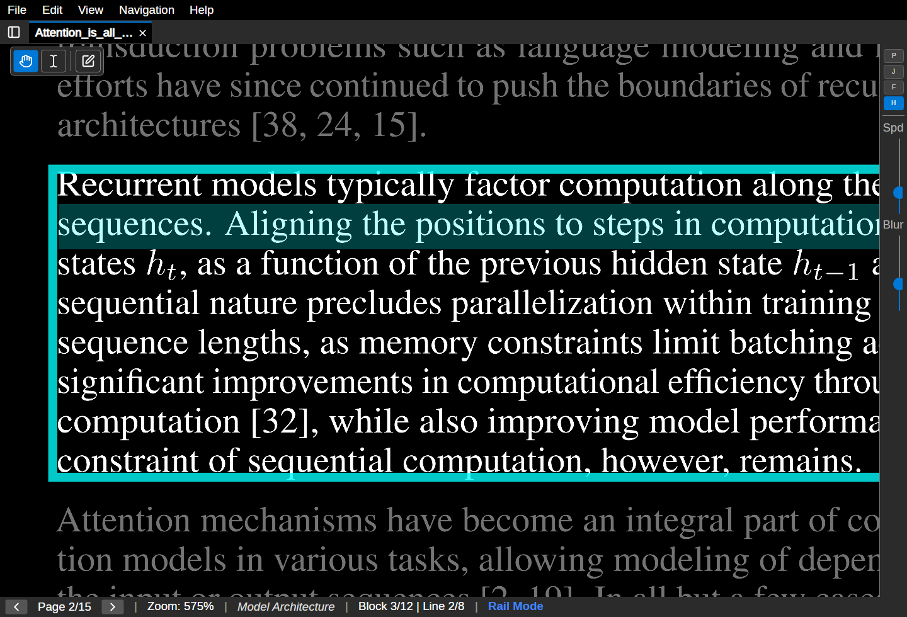
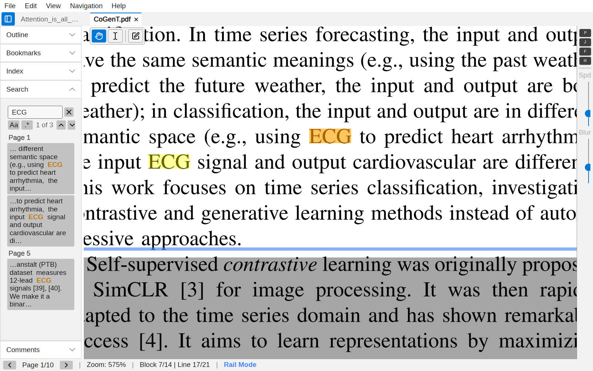
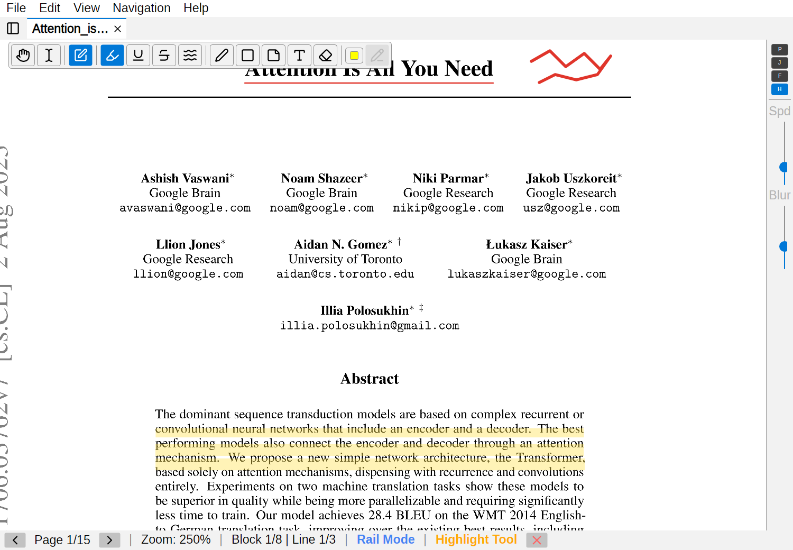

# railreader2 User Guide

Everything you need to know to get the most out of railreader2.

> **Web version:** This guide is also available as an [HTML page](https://sjvrensburg.github.io/railreader2/guide.html) with inline screenshots and lightbox image viewing.

## Contents

1. [Getting Started](#getting-started)
2. [Basic Navigation](#basic-navigation)
3. [Rail Mode](#rail-mode)
4. [Auto-Scroll](#auto-scroll)
5. [Jump Mode](#jump-mode)
6. [Line Focus & Highlight](#line-focus--highlight)
7. [Colour Effects](#colour-effects)
8. [Search](#search)
9. [Annotations](#annotations)
10. [Text Selection](#text-selection)
11. [Bookmarks](#bookmarks)
12. [Settings](#settings)
13. [Troubleshooting](#troubleshooting)
14. [Keyboard Shortcuts](#keyboard-shortcuts)
15. [Removed Features](#removed-features)

---

## Getting Started

### Download and install

The AI layout model is bundled in all packages.

- **Linux:** Download `railreader2-linux-x86_64.AppImage` from [GitHub Releases](https://github.com/sjvrensburg/railreader2/releases/latest), make it executable (`chmod +x railreader2-linux-x86_64.AppImage`), and run it.
- **Windows (Microsoft Store):** Install directly from the [Microsoft Store](https://apps.microsoft.com/store/detail/9P9J8KZ6RVZP) for automatic updates, no SmartScreen warnings, and clean install/uninstall. The Store release may lag behind the GitHub release by a few days due to certification review.
- **Windows (standalone installer):** Download `railreader2-setup-x64.exe` from [GitHub Releases](https://github.com/sjvrensburg/railreader2/releases/latest) and run it. Optionally associate `.pdf` files during setup. This always has the latest version immediately.

### Opening a PDF

Use **File > Open** or press `Ctrl+O` to open a PDF. You can also pass a file path as a command-line argument. When no file is open, a welcome screen shows with instructions.

### First steps

Once a PDF is open, scroll through pages with `PgDn`/`PgUp`, zoom with `+`/`-` or mouse wheel, and pan by dragging. When you zoom past 3x, **rail mode** activates automatically — this is where the AI-guided reading begins.

---

## Basic Navigation

### Zoom and pan

**Mouse wheel** zooms towards the cursor. `+` and `-` keys zoom in and out. All zoom actions animate smoothly over ~180ms with cubic ease-out. Rapid scroll wheel inputs accumulate into the in-progress animation for fluid zooming. Press `0` to fit the page to the window. Use **View > Fit Width** to fill the viewport horizontally.

**Click and drag** to pan. Arrow keys also pan when not in rail mode.

### Page navigation

| Key | Action |
|-----|--------|
| `PgDn` / `PgUp` | Next / previous page |
| `Home` / `End` | First / last page |
| `Ctrl+G` | Go to a specific page number |
| `Space` | Next line (in rail mode) or next page |

> **Edge-hold page navigation:** When not in rail mode, holding `Down` or `S` at the bottom of the page for 400ms automatically advances to the next page. Similarly, holding `Up` or `W` at the top of the page goes to the previous page.

### Minimap and outline

Press `Ctrl+M` to toggle the **minimap** — a small page thumbnail in the corner. Click or drag on it to navigate.

Press `Ctrl+Shift+O` to open the **outline panel** (table of contents). Click entries to jump to sections. Press `Ctrl+Shift+B` to open the **bookmarks panel** — see [Bookmarks](#bookmarks).

### Multi-tab

Open multiple PDFs in tabs with `Ctrl+O`. Each tab has independent zoom, position, and analysis state. Switch tabs with `Ctrl+Tab` or by clicking. Drag tabs to reorder.

**Right-click any tab** to open a context menu with:
- **Duplicate Tab** — opens the same PDF in a new tab
- **Duplicate Tab (Linked)** — opens same PDF linked to this tab (always on same page)
- **Link to...** — link to another tab showing the same document
- **Unlink Tab** — remove from link group
- **Detach Tab** — moves the tab to a new window
- **Close Tab** — closes the tab

**Linked tabs** always show the same page — navigating to a new page in one tab automatically updates the other. Each linked tab has independent zoom and scroll position, so you can view the same page at different magnifications simultaneously. Linked tabs are indicated by a chain icon and a colored dot on the tab header, and they always stay adjacent in the tab bar.

**Tab bar overflow:** When many tabs are open, they shrink with ellipsis text. Use the mouse wheel to scroll the tab bar horizontally, or click the **▼** dropdown to see all tabs and jump to one.

Switching tabs automatically exits any active annotation mode to prevent accidental edits on the wrong document.

---

## Rail Mode

Rail mode is the core feature of railreader2. When you zoom past the threshold (default 3x), the AI layout analysis detects text blocks and reading order, and navigation locks to those blocks. Non-active regions are dimmed so you can focus on the current block and line.

*Rail mode — line-by-line reading at high magnification with the current line highlighted*

### Free pan

Hold `Ctrl` and drag to temporarily pan freely, even zooming out below the rail threshold. This lets you quickly check a figure, equation, or footnote elsewhere on the same page without losing your place. Release `Ctrl` to snap back to your original reading position and zoom level.

### Zoom position preservation

Zooming while reading a line now preserves your horizontal scroll position, so you can adjust magnification without losing your place in the text.

### Line-by-line navigation

| Key | Action |
|-----|--------|
| `Down` / `S` | Next line |
| `Up` / `W` | Previous line |
| `Right` / `D` | Hold to scroll forward along the line |
| `Left` / `A` | Hold to scroll backward |
| `Home` / `End` | Snap to start/end of current line |

When you reach the last line of a block, pressing `Down` advances to the next navigable block. At the last block on a page, it advances to the next page.

### Click to jump

Click on any detected block in rail mode to jump directly to it. The view snaps to the clicked block's first line.

### Horizontal scrolling

Holding `Right`/`D` scrolls horizontally along the current line with speed ramping — it starts slow and accelerates. `Ctrl + mouse wheel` also scrolls horizontally. The speed ramp time and max speed are configurable in Settings.

> **Tip:** Press `Shift+D` to toggle the debug overlay, which shows all detected layout blocks with their class labels, confidence scores, and reading order.

### Rail toolbar

When rail mode is active, a floating toolbar appears with **P** (auto-scroll), **J** (jump mode), **F** (line focus dim), and **H** (line highlight) toggle buttons, plus a speed/distance slider.

---

## Auto-Scroll

Press `P` in rail mode to toggle **auto-scroll**. The view continuously scrolls horizontally along the current line, then advances to the next line when it reaches the edge.

- **Speed boost:** Hold `D` or `Right` during auto-scroll to double the speed.
- **Pauses:** Auto-scroll pauses briefly at line boundaries (default 400ms) and block/page transitions (default 600ms) to let your eyes settle. Configurable in Settings > Auto-Scroll.
- **Auto-scroll trigger:** Optionally, auto-scroll can start automatically after holding `D` or `Right` for a configurable delay. Enable this in Settings > Auto-Scroll > **Enable auto-scroll trigger** and set the desired hold duration.
- **Stop:** Press `Escape`, `P`, or any opposing navigation key (`Up`, `Left`).

The status bar shows a green **"Auto-Scroll"** indicator when active. Adjust speed with the rail toolbar slider or the `[` / `]` keys.

---

## Jump Mode

Press `J` in rail mode to toggle **jump mode**. Instead of continuous scrolling, `Right`/`D` and `Left`/`A` perform saccade-style jumps — advancing by a configurable percentage of the visible width (default 25%).

Hold `Shift` with `Right` or `Left` to perform a **short jump** at half the normal distance. This is useful for fine-grained positioning within a line.

This mimics natural reading eye movements and is useful for scanning text quickly. Adjust jump distance with `[` / `]` or in Settings > Rail Reading.

> **Note:** Auto-scroll and jump mode are mutually exclusive. Enabling one disables the other.

---

## Line Focus & Highlight

### Line focus dim

When enabled, line focus dim applies a smooth feathered dimming overlay to the entire page except the active line in rail mode. Non-active lines fade toward the background colour, reducing peripheral distraction while maintaining a clean visual transition.

*Line focus dim — non-active lines are dimmed to reduce distraction*

Toggle with the `F` key, the **F** button on the rail toolbar, or in Settings > Rail Reading. Dim intensity is adjustable from 0 (off) to 1 (maximum). The line padding (how much extra space stays fully visible around the active line) is also configurable.

### Line highlight tint

The active line in rail mode can have a configurable colour tint applied as an overlay. This makes the current line stand out more clearly, especially at high magnification. Toggle independently with the `H` key or the **H** button on the rail toolbar. Line highlight works with or without line focus dim enabled.

Choose from five presets in Settings > Rail Reading:

| Tint | Description |
|------|-------------|
| **Auto** | Adapts to the active colour effect (amber tint for Amber, green for HighContrast/HighVisibility, etc.) |
| **Yellow** | Warm yellow highlighter |
| **Cyan** | Cool cyan tint |
| **Green** | Soft green tint |
| **None** | No tint — line is highlighted by dimming only |

Opacity is adjustable from 0.0 (invisible) to 1.0 (fully opaque). The default is Auto at 25% opacity.

---

## Colour Effects

Four GPU-accelerated colour filters are available, applied only to PDF content (not the UI). Access via **View > Colour Effect**, Settings > Appearance, or press `C` to cycle through effects on the active tab.

Each tab keeps its own colour effect independently — you can have one PDF in Amber and another in High Contrast. The per-tab effect is saved with the reading position and restored when you reopen the file.

| Effect | Description |
|--------|-------------|
| **Amber Filter** | Warm tint that reduces blue light and perceived haze. Good for extended reading. |
| **High Contrast** | White-on-black rendering with an S-curve for maximum contrast. Reduces glare. |
| **High Visibility** | Yellow-on-black for maximum legibility at the cost of colour information. |
| **Invert** | Simple colour inversion for dark backgrounds. |

  
  &nbsp;
  

Each effect has adjustable intensity (0.0 to 1.0). Rail mode overlay colours automatically adapt to the active colour effect for readable contrast.

> **Tip:** Press `C` to quickly cycle through colour effects. The status bar briefly shows the active effect name.

---

## Search

Press `Ctrl+F` to open the search panel in the sidebar. The search tab sits alongside the Outline and Bookmarks tabs. Type your query — results appear automatically after a brief debounce.

*Search results — matches grouped by page in the sidebar, highlighted on the page in yellow with the active match in orange*

- **Results panel:** Matches are grouped by page with text snippets showing the match term in context (bolded). Click any result to jump directly to that match.
- **Navigate matches:** `Enter` / `Shift+Enter` in the search input, `F3` / `Shift+F3` globally, or the arrow buttons in the panel.
- **Case sensitivity:** Toggle with the `Aa` button.
- **Regex:** Toggle with the `.*` button for regular expression search.
- **Match count:** The panel shows the current match index and total count (e.g. "3 of 42").
- **Clear:** Click the clear button (✕) to remove all highlights and results, or press `Escape`.

---

## Annotations

Right-click anywhere on the page to open the **radial menu** with five annotation tools:

*Annotations — highlights and text notes on a PDF page*

| Tool | Key | Description |
|------|-----|-------------|
| **Highlight** | `1` | Click and drag over text to highlight. Uses character-level detection. Choose from yellow, green, or pink via the radial menu colour picker. |
| **Pen** | `2` | Freehand drawing. Choose from red, blue, or black via the radial menu colour picker. |
| **Rectangle** | `3` | Draw rectangular outlines or filled regions. |
| **Text Note** | `4` | Click to place a note. Shows as a small folded-corner icon; click the icon in browse mode to expand/collapse the popup. Click an existing note in Text Note mode to edit. |
| **Eraser** | `5` | Click on an annotation to remove it. |

### Tool cursors

Each annotation tool shows a distinct mouse cursor so you always know the active mode:
- **Highlight, Pen, Rectangle, Text Note** — crosshair cursor
- **Eraser** — no-entry cursor
- **Text Select** — I-beam cursor
- **Browse (no tool)** — default arrow cursor

### Colour picker

The **Highlight** and **Pen** segments on the radial menu have colour options. Tap the segment to reveal an outer ring of colour dots. Tap a colour to select it and activate the tool. A small indicator dot on the segment shows the currently active colour.

### Popup notes

Text notes display as a compact folded-corner icon (16px). In browse mode, click the icon to expand a floating popup showing the full note text with word wrapping. Click again to collapse. Double-click or use the Text Note tool to edit.

### Select, move, and resize

In **browse mode** (no annotation tool active), click on any annotation to select it (shown with a dashed blue outline). Drag a selected annotation to move it. For freehand annotations, 8 resize handles appear on the bounding box — drag a handle to scale proportionally. All move and resize actions support undo/redo.

### Delete selected annotation

Press `Delete` or `Backspace` in browse mode to remove the selected annotation. This uses the same undo-supported removal as the eraser.

### Undo and redo

`Ctrl+Z` undoes the last annotation action (including moves, resizes, and deletions). `Ctrl+Y` or `Ctrl+Shift+Z` redoes. Each tab has an independent undo/redo stack.

### Persistence

Annotations are saved automatically as JSON sidecar files alongside the PDF (e.g. `paper.pdf.annotations.json`). They load automatically when you reopen the file.

### Export

Use **File > Export with Annotations** to create a new PDF with annotations rendered into the pages. The original PDF is not modified.

Use **File > Export Annotations as JSON** to save all annotations and bookmarks for the current document to a JSON file. This is useful for backup, scripting, or sharing with other RailReader2 users.

Use **File > Import Annotations...** to import annotations from a JSON file. Imported annotations are merged with any existing annotations on the active document — your annotations are preserved, and the imported ones are added alongside them. Duplicate bookmarks (same name and page) are skipped.

---

## Text Selection

The floating toolbar in the top-left corner provides three modes:

- **Browse** — Default pan mode.
- **Text Select** — Click and drag to select text. Selection uses character-level bounding boxes for precise results.
- **Copy** — Appears when text is selected. Click to copy, or use `Ctrl+C`.

Press `Escape` to cancel selection and return to browse mode.

---

## Bookmarks

Press `B` to bookmark the current page, or click **+ Add Bookmark** in the bookmarks panel. A dialog lets you name the bookmark (pre-filled with "Page N").

### Managing bookmarks

Press `Ctrl+Shift+B` to open the bookmarks panel (a tab alongside the outline panel). Each bookmark shows its name and page number.

- **Navigate:** Click a bookmark to jump to that page (zoom resets to fit the page).
- **Rename:** Click the **Rename** button on a bookmark to change its name.
- **Delete:** Click the **Delete** button to remove a bookmark.
- **Back:** After navigating to a bookmark, a **"Back to previous location"** button appears at the top of the list. Click it or press `` ` `` (backtick) to return to where you were.

### Duplicate handling

If you bookmark a page that already has a bookmark, the existing bookmark's name is updated instead of creating a duplicate.

### Persistence

Bookmarks are stored in the same annotation sidecar file as highlights, notes, and other annotations (`<pdf>.railreader2.json`). They persist across sessions automatically.

---

## Settings

Press `Ctrl+,` or use the menu to open Settings. Changes take effect immediately and are saved automatically.

### Appearance
- **UI Font Scale:** Adjust the size of all UI text (default 1.25x).
- **Dark Mode:** Switch the UI to a dark theme. Takes effect immediately.
- **Motion Blur:** Toggle and adjust intensity of directional blur during scroll/zoom.
- **Colour Effect:** Select and configure the active colour filter (applies globally via Settings; use `C` key for per-tab cycling).

### Rail Reading
- **Zoom Threshold:** Zoom level at which rail mode activates (default 3.0x).
- **Snap Duration:** Duration of line-snap animations in milliseconds.
- **Scroll Speed:** Start and max speed for horizontal hold-to-scroll.
- **Ramp Time:** Seconds to reach max scroll speed from start.
- **Pixel Snapping:** Quantise camera to pixel grid to reduce text shimmer.
- **Line Focus Dim:** Toggle and set intensity and padding.
- **Line Highlight:** Toggle the active-line highlight independently (works with or without line focus dim). Choose a colour tint (Auto, Yellow, Cyan, Green, None) and set opacity.
- **Jump Distance:** Percentage of visible width for jump mode (5–80%).

### Auto-Scroll
- **Line Pause:** Pause duration at line boundaries (ms, 0 to disable).
- **Block Pause:** Pause duration at block/page boundaries (ms, 0 to disable).

### Advanced
- **Navigable Block Types:** Choose which PP-DocLayoutV3 block types are navigable in rail mode.
- **Centered Block Types:** Choose which block types are horizontally centered when they are narrower than the viewport. By default, headings (paragraph_title, doc_title) are excluded so they stay left-aligned with surrounding text, while formulae and body text are centered.
- **Analysis Lookahead:** Number of pages to pre-analyze ahead (0 to disable).

### Config file

Configuration is stored at `~/.config/railreader2/config.json` (Linux) or `%APPDATA%\railreader2\config.json` (Windows). You can edit it directly; restart the app to apply changes.

---

## Troubleshooting

RailReader2 writes a diagnostic log during each session. If you encounter a problem, the log helps developers understand what happened.

### Exporting the log

- **Help → Export Diagnostic Log...** opens a save dialog to export a copy of the current session log.
- **Help → About** shows the log file path at the bottom of the dialog. Click the copy icon next to the path to copy it to the clipboard, then attach the file to a bug report.

The log file is located at:
- **Linux:** `~/.config/railreader2/session.log`
- **Windows:** `%APPDATA%\railreader2\session.log`
- **macOS:** `~/Library/Application Support/railreader2/session.log`

The log is overwritten at the start of each session. Old `.log` files are automatically removed after 7 days by the cleanup service.

---

## Keyboard Shortcuts

### General

| Key | Action |
|-----|--------|
| `Ctrl+O` | Open file |
| `Ctrl+W` | Close tab |
| `Ctrl+Tab` | Next tab |
| `Ctrl+Q` | Quit |
| `Ctrl+,` | Settings |
| `Ctrl+M` | Toggle minimap |
| `Ctrl+Shift+O` | Toggle outline panel |
| `Ctrl+Shift+B` | Toggle bookmarks panel |
| `Ctrl+G` | Go to page |
| `F1` | Keyboard shortcuts dialog |
| `F11` | Toggle fullscreen |

### Navigation

| Key | Action |
|-----|--------|
| `PgDn` / `PgUp` | Next / previous page |
| `Home` / `End` | First / last page |
| `Space` | Next line (rail) or next page |
| `+` / `-` | Zoom in / out |
| `0` | Fit page to window |
| `Shift+D` | Toggle debug overlay |

### Rail Mode

| Key | Action |
|-----|--------|
| `Down` / `S` | Next line |
| `Up` / `W` | Previous line |
| `Right` / `D` | Scroll forward (hold) |
| `Left` / `A` | Scroll backward (hold) |
| `Shift+Right` / `Shift+Left` | Short jump — half distance (jump mode) |
| `Home` / `End` | Line start / end |
| `P` | Toggle auto-scroll |
| `J` | Toggle jump mode |
| `B` | Add bookmark for current page |
| `` ` `` (backtick) | Navigate back to previous location |
| `C` | Cycle colour effect on active tab |
| `F` | Toggle line focus dim |
| `H` | Toggle line highlight |
| `Ctrl+Drag` | Free pan (release Ctrl to snap back) |
| `[` / `]` | Adjust speed or jump distance |
| `Shift+[` / `Shift+]` | Adjust blur intensity |
| Click | Jump to block |

### Search & Annotations

| Key | Action |
|-----|--------|
| `Ctrl+F` | Open search panel |
| `F3` / `Shift+F3` | Next / previous match |
| `1` / `2` / `3` / `4` / `5` | Highlight / Pen / Rectangle / Text Note / Eraser |
| Right-click | Open radial menu (with colour picker for Highlight/Pen) |
| `Ctrl+Z` | Undo |
| `Ctrl+Y` | Redo |
| `Delete` / `Backspace` | Delete selected annotation (browse mode) |
| `Ctrl+C` | Copy selected text |
| `Escape` | Cancel / close / stop / exit fullscreen |

---

## Removed Features

### Bionic Reading (Removed in 3.2)

Bionic reading was a GPU shader-based reading aid that de-emphasised the trailing portion of each word, guiding the eye to fixation points at the start of words. It was removed because it was counterproductive with mathematically complex documents.

### AI Agent CLI (Removed in 3.2)

The CLI and Agent projects were developer tools not included in binary releases and have been removed to simplify the codebase.
